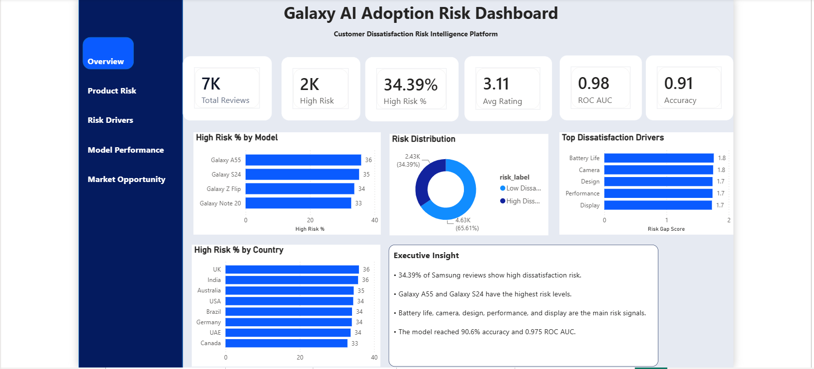
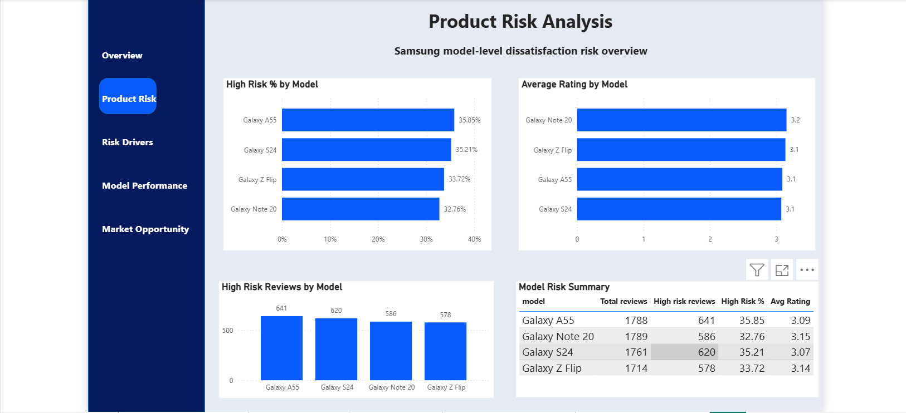
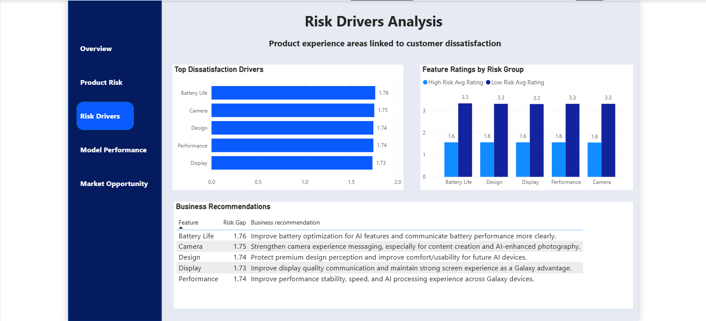
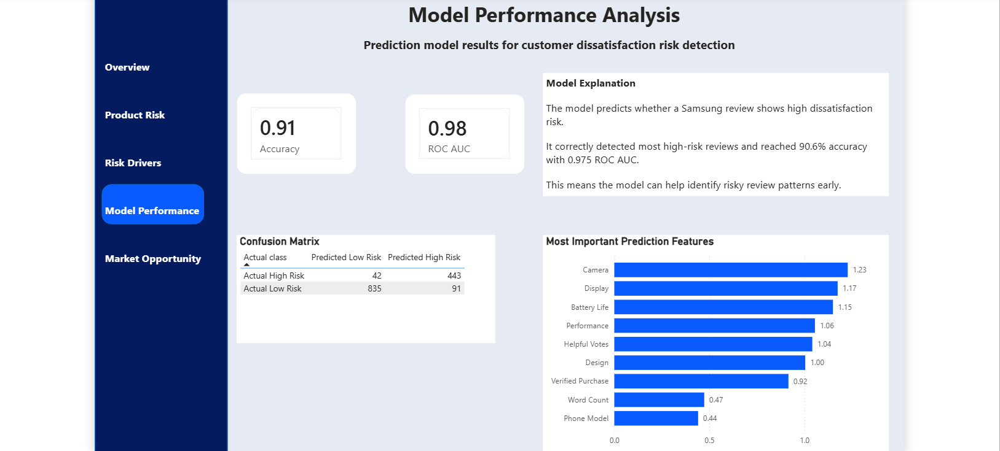
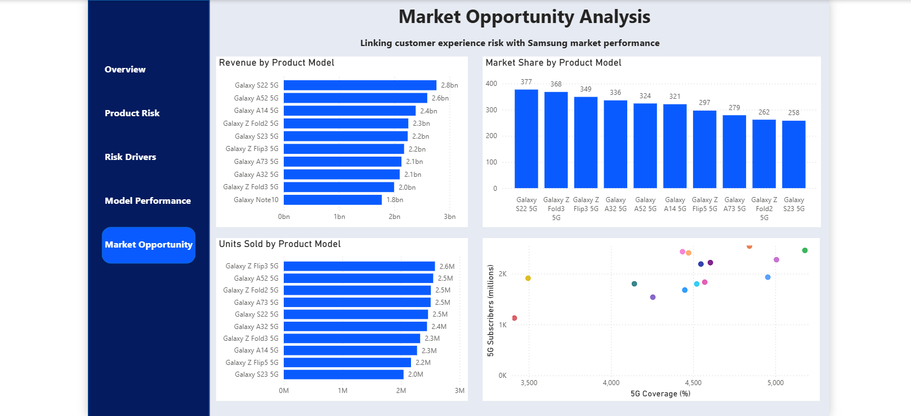

# Galaxy AI Adoption Risk Dashboard

## Project Overview

This project analyzes Samsung mobile customer reviews to identify dissatisfaction risk and support future Galaxy AI adoption strategy.

The idea behind this project is simple:

Before customers fully adopt future AI-powered mobile experiences, companies need to understand what already makes some users unhappy today.

Using Samsung mobile review data, I built a dashboard and prediction model to answer questions like:

* Which Samsung models show the highest dissatisfaction risk?
* Which product areas are customers most unhappy about?
* Can we detect high-risk customer reviews early?
* How can customer feedback support better product and business decisions?

---

## Business Problem

Customer reviews are more than just comments. They can act as early warning signs.

If many customers complain about battery life, camera, performance, design, or display quality, this can affect customer trust and reduce adoption of future Galaxy AI features.

This project turns customer feedback into a simple risk intelligence dashboard that can help decision-makers understand where attention is needed.

---

## Dataset

The project uses a global mobile review dataset containing Samsung customer reviews and product experience ratings.

For this version, the analysis focuses on **7,052 Samsung reviews**.

Main fields used include:

* Brand
* Product model
* Rating
* Sentiment
* Country
* Review text
* Battery life rating
* Camera rating
* Performance rating
* Design rating
* Display rating
* Review length
* Helpful votes
* Review source/platform

The full raw dataset is not uploaded in this repository. A small sample dataset may be added later for demonstration.

---

## Tools Used

* Python
* Pandas
* NumPy
* Scikit-learn
* Power BI
* Jupyter Notebook / VS Code

---

## Project Workflow

The project followed these steps:

1. Loaded and explored the mobile review dataset
2. Filtered the data to focus on Samsung reviews
3. Created a dissatisfaction risk label
4. Analyzed risk by model, country, and product experience ratings
5. Prepared a modelling dataset
6. Built a prediction model to detect high-risk reviews
7. Exported cleaned tables for Power BI
8. Built a professional Power BI dashboard with 5 pages

---

## Risk Definition

A review was classified as **high dissatisfaction risk** when:

* The rating was 1 or 2, or
* The sentiment was negative

This created the target variable:

* `1` = High Dissatisfaction Risk
* `0` = Low Dissatisfaction Risk

---

## Key Findings

From **7,052 Samsung reviews**:

* **34.39%** of reviews showed high dissatisfaction risk
* **65.61%** of reviews showed low dissatisfaction risk
* Galaxy A55 and Galaxy S24 showed some of the highest risk levels in the dataset
* Battery life, camera, design, performance, and display ratings were the main signals linked to dissatisfaction
* Some countries showed slightly higher dissatisfaction risk levels than others

---

## Model Performance

A machine learning model was trained to predict whether a Samsung review shows high dissatisfaction risk.

Model results:

* **Accuracy:** 90.6%
* **ROC AUC:** 0.975

The model correctly detected most high-risk reviews and showed strong ability to separate high-risk and low-risk review patterns.

---

## Dashboard Pages

The Power BI dashboard contains five pages:

1. **Executive Overview**
   A summary of total reviews, high-risk reviews, risk distribution, top drivers, country risk, and executive insights.

2. **Product Risk**
   A model-level view showing which Samsung devices have higher dissatisfaction risk.

3. **Risk Drivers**
   A feature-level view showing the product experience areas most linked to dissatisfaction.

4. **Model Performance**
   A summary of prediction model results, confusion matrix, and most important prediction features.

5. **Market Opportunity**
   A market-level view connecting Samsung sales and 5G readiness with customer experience risk.

---

## Dashboard Preview

### Executive Overview



### Product Risk



### Risk Drivers



### Model Performance



### Market Opportunity



---

## Repository Structure

```text
galaxy-ai-adoption-risk-dashboard
│
├── README.md
├── requirements.txt
│
├── screenshots
│   ├── executive_overview.png
│   ├── product_risk.png
│   ├── risk_drivers.png
│   ├── model_performance.png
│   └── market_opportunity.png
│
├── powerbi
│   └── Galaxy_AI_Adoption_Risk_Dashboard.pbix
│
├── notebooks
│   ├── 01_data_understanding.ipynb
│   └── 02_prediction_model.ipynb
│
├── visuals
│   └── linkedin_project_cover.png
│
└── data_samples
```

---

## How to Run the Python Notebooks

Install the required Python libraries:

```bash
pip install -r requirements.txt
```

Then open the notebooks in Jupyter Notebook or VS Code:

```text
notebooks/01_data_understanding.ipynb
notebooks/02_prediction_model.ipynb
```

---

## Limitations

This is an independent portfolio project and not an official Samsung project.

The current dataset includes available Samsung review data, but it does not fully represent all future Galaxy AI devices. The project is designed as a reusable framework that can be updated later with newer Galaxy S25/S26 review data when available.

The prediction model is useful for identifying patterns in review data, but it should not be treated as a perfect business decision tool without further validation.

---

## Future Improvements

Possible future improvements include:

* Adding a small sample dataset to the repository
* Improving the model with more recent Galaxy AI review data
* Adding more advanced text analysis from customer review comments
* Creating a public Power BI web version if publishing is available
* Adding more business recommendations by region and product model
* Updating the dashboard with newer Samsung device reviews

---

## Project Status

Version 1 is complete.

Completed:

* Data exploration
* Samsung review filtering
* Dissatisfaction risk creation
* Risk analysis by model, country, and feature
* Prediction model
* Power BI dashboard
* Dashboard screenshots for portfolio presentation

---

## Note

This project is an independent data analytics and machine learning portfolio project. It is not affiliated with Samsung.
